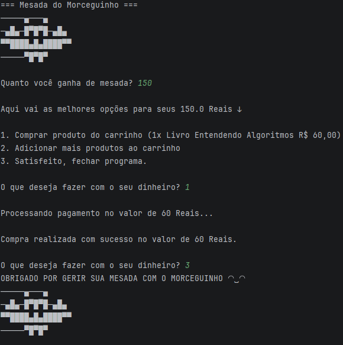

# Mesada com o Morceguinho 🦇💰

Projeto simples para aplicar na prática conceitos básicos de Java.

## Funcionalidades
- Laço do-while até "satisfeito"
- Verificação if saldo suficiente
- Subtração automática do saldo
- Menu com 3 opções (comprar / adicionar ao carrinho / sair)

